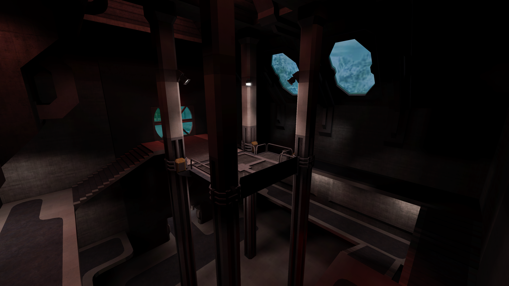

# Karith Station 2

This is a map ported from the [Tremulous](https://tremulous.net) game to the [Unvanquished](https://unvanquished.net) game. It features a heating facility on the cold ruins of an eerie, empty human colony on a frozen planet.

It is ported from the Tremulous GPP package from [ingar.intranifty.net/files/tremulous/base](ingar.intranifty.net/files/tremulous/base/).

This port is an Interstellar Oasis initiative: [github.com/InterstellarOasis/InterstellarOasis](https://github.com/InterstellarOasis/InterstellarOasis).

## Levelshot

## How-to

This package is meant to be built using [Urcheon](https://github.com/DaemonEngine/Urcheon).

## Credits

Unvanquished port:

* Thomas “illwieckz” Debesse <hidden email="dev [ad] illwieckz.net"/> ([gg.illwieckz.net](https://gg.illwieckz.net))

Mapping:

* Gordon “Godmil” Miller <hidden email="godmil [ad] email.com"/> ([godmil.com](https://web.archive.org/web/20181110004551/http://www.godmil.com/))

Textures & Shaders:

* Gordon “Godmil” Miller
* Nicolas “Jex“ Jansens <hidden email="jex [ad] orodu.net"/>
* Randy “ydnar” Redding <hidden email="ydnar [ad] shaderlab.com"/> ([shaderlab.com](https://www.shaderlab.com))
* Yves “evil lair” Allaire ([evillair.net](https://evillair.net))
* Chris “Amethyst” Matz
* Mike “Vedacon” McInnerney

Models:

* Mike “Vedacon” McInnerney

Special thanks:

* Tim “Timbo” Angus <hidden email="tim [ad] ngus.net"/>
* Stijn “Ingar“ Buys <hidden email="ingar [ad] osirion.org"/>
* Jan “Stannum” Van der Weg ([janvanderweg.com](http://janvanderweg.com))
* Paul “MoP” Greveson ([predictable-paul.com](https://www.predictable-paul.com))
* Robin “OverFlow” Marshall ([bobbin.vilkacis.net](http://bobbin.vilkacis.net))
* Dan “kharnov” Floda
* Tristan “Jhrx“ Blease
* Crimity
* Lava Croft
* Lifer
* Myth
* Roughrider

## Legal

Changes by Thomas Debesse fall under the Creative Commons Attribution 4.0 International License:  
http://creativecommons.org/licenses/by/4.0/

Assets by Tremulous contributors fall under the Creative Commons Attribution-ShareAlike 2.5 Generic License:  
http://creativecommons.org/licenses/by-sa/2.5/

Textures by Yves Allaire fall under the Creative Commons Attribution-ShareAlike 4.0 International License:  
http://creativecommons.org/licenses/by-sa/4.0/

Textures by Chris Matz fall under the GNU General Public License version 2:  
http://www.gnu.org/licenses/old-licenses/gpl-2.0.en.html

Textures from shaderlab are subject to the terms of this notice:  
Usage and redistribution policy: Textures may be freely downloaded, modified, and used in free maps, mods or total conversions provided this copyright notice is left intact and a link to Shaderlab is provided in the credits or read-me file. Other non-commercial applications are considered on a case-by-case basis via e-mail. All other usage requires written permission. Bulk redistribution or archival of the textures in any medium, digital or otherwise (except mapping packages for mods) is prohibited.

## History

* 2015-08-16: Karith Station 2 1.2 (Unvanquished community map)
* 2009-12-04: Tremulous 1.2 Beta (Gameplay preview)
* 2006-03-31: Tremulous 1.1.0 (Standalone)
